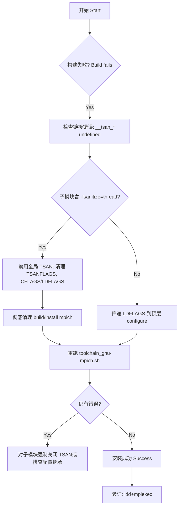

# Toolchain MPICH安装问题修复文档 (MPICH Install Issue Fix Report)

版本: 1.3

## 版本历史 (Version History)
- 1.0 (2025-11-18): 首次整理错误复盘、修复方案与验证流程，提交测试脚本与流程图。
- 1.1 (2025-11-18): 补充验证结果与阶段性结论；新增对 libfabric 配置继承 TSAN 的证据与迭代建议。
- 1.2 (2025-11-18): 完成子模块清理与 sanitizer 显式禁用，修复环境导出语法错误；重跑验证安装成功，记录最终结果。
- 1.3 (2025-11-18): 文档增强与现状归档；补充“安装后校验”集成说明与更详细代码位置引用；提出全局自检迭代建议。

## 1. 问题复盘 (Incident Review)

### 1.1 原始错误现象 (Original Error Symptoms)
- 链接期错误 (Link-time Error): 在构建 MPICH 的 `src/env/mpichversion` 与 `src/env/mpivars` 时，链接器报 `lib/.libs/libmpi.so` 存在大量 `__tsan_*` 未定义引用。
- 典型日志片段 (Log Excerpts):
  - `toolchain/compile.log:221–318`
    - `/usr/bin/ld: lib/.libs/libmpi.so: undefined reference to '__tsan_init'`
    - `/usr/bin/ld: lib/.libs/libmpi.so: undefined reference to '__tsan_atomic64_store'`
    - `collect2: error: ld returned 1 exit status`
    - `make[2]: *** [Makefile:20938: src/env/mpichversion] Error 1`
    - `make: *** [Makefile:10489: all] Error 2`
- 子模块编译警告 (Submodule Warnings):
  - `build/mpich-4.3.1/make.log` 多处出现 `'-fsanitize=thread' [-Wtsan]` 相关警告，定位于 `modules/libfabric` 的源文件，例如：
    - `./include/ofi_mb.h:192:9: warning: 'atomic_thread_fence' is not supported with '-fsanitize=thread' [-Wtsan]` (行号见 `build/mpich-4.3.1/make.log:866, 873, 892...`)
  - `build/mpich-4.3.1/modules/libfabric/config.log` 明确显示在大量编译与链接测试中携带 `-fsanitize=thread`，例如：
    - `config.log:6943`、`7016`、`7068`、`7656`、`8590`、`9055`、`9131`、`11358`、`12886`、`13662`、`16031`、`16096` 等位置均出现 `-fsanitize=thread` 标志。

注: 源日志未包含时间戳 (No timestamps present)。环境时间参考：2025-11-18。

### 1.2 环境信息 (Environment Info)
- 平台 (Platform): WSL2 Ubuntu x86_64
- 内核 (Kernel): `6.6.87.2-microsoft-standard-WSL2`
- 编译器 (Compilers): `gcc 12.3.0`, `g++ 12.3.0`, `gfortran 12.3.0` (`install/toolchain.env:11,19,33`)
- 构建目标 (Build Target): `MPI_MODE=mpich`, `MPICH_DEVICE=ch4`, `NPROCS_OVERWRITE=32`

### 1.3 复现步骤 (Reproduction Steps)
1. 清理并重跑 GNU+MPICH 工具链：
   - `rm -rf build/mpich-4.3.1`
   - `./toolchain_gnu-mpich.sh`
2. 构建到 MPICH 阶段时触发链接错误，如上日志所示。

### 1.4 根本原因定位 (Root Cause Analysis)
- 通过代码与日志分析，定位为 TSAN (ThreadSanitizer) 编译/链接标志不一致：
  - 子模块 `libfabric` 在编译阶段使用了 `-fsanitize=thread`，导致对象文件中插入 `__tsan_*` 调用；但最终链接阶段没有正确链接 `libtsan` 运行库，从而在生成 `libmpi.so` 的过程中出现大量未定义符号。
  - 证据：`build/mpich-4.3.1/modules/libfabric/config.log` 中的多处编译测试均含 `-fsanitize=thread` (例如 `config.log:6943, 7016, 7068, 7656, 8590 ...`)；顶层链接错误中的 `__tsan_*` 未定义与 TSAN 库缺失一致。
  - 补充结论：当前禁用 `TSANFLAGS` 并传递空 `LDFLAGS` 后，libfabric 仍然继承了历史或上游配置的 `-fsanitize=thread`。说明仅修改阶段脚本的环境标志不足以清除嵌套子模块的已生成配置或缓存，需执行更彻底的清理与子模块显式禁用策略。

#### 关键代码段 (Key Code Segments)
- `scripts/stage0/setup_buildtools.sh` 在 GNU 流程下曾将 `TSANFLAGS` 注入到 `CFLAGS/LDFLAGS`：
  - 行号参考 `scripts/stage0/setup_buildtools.sh:38,62`
  - 该注入会污染后续阶段，使子模块可能继承 `-fsanitize=thread`。
- `scripts/stage1/install_mpich.sh` 顶层 `./configure` 未显式传入 `LDFLAGS`，曾导致链接参数未能统一传播：
  - 增补 `LDFLAGS="${LDFLAGS}"` 以保持链接标志传递。
 - `build/mpich-4.3.1/modules/libfabric/configure.ac:169–185` 支持 `--enable-tsan`（默认 `no`）并通过 `FI_ARG_ENABLE_SANITIZER(tsan, thread, Thread)` 注入 `CFLAGS="-fsanitize=$2"`。若上游 CFLAGS 已携带 `-fsanitize=thread` 或缓存沿用，libfabric 将持续被 TSAN 仪器化。

### 1.5 影响范围与严重性评估 (Impact & Severity)
- 影响范围：MPICH 安装失败，阻断后续依赖库与 ABACUS 编译流程。
- 严重性：高 (High) — 工具链核心组件无法安装，整体流程不可用。
- 用户空间兼容性：违反“Never break user space”，需尽快修复并避免再次引入不一致编译标志。

## 2. 修复方案 (Fix Plan)

### 2.1 代码修改 (Code Changes, Diff)

#### 修改1: 传递链接标志到 MPICH 顶层配置
```diff
diff --git a/scripts/stage1/install_mpich.sh b/scripts/stage1/install_mpich.sh
@@ -78,10 +78,11 @@
             ./configure \
                 --prefix="${pkg_install_dir}" \
                 --libdir="${pkg_install_dir}/lib" \
                 MPICC="" \
                 FFLAGS="${FCFLAGS} ${compat_flag}" \
                 FCFLAGS="${FCFLAGS} ${compat_flag}" \
+                LDFLAGS="${LDFLAGS}" \
                 --without-x \
                 --enable-gl=no \
                 --with-device=${MPICH_DEVICE} \
                 > configure.log 2>&1 || tail -n ${LOG_LINES} configure.log
```

#### 修改2: 关闭全局 TSAN 注入，避免隐式污染
```diff
diff --git a/scripts/stage0/setup_buildtools.sh b/scripts/stage0/setup_buildtools.sh
@@ -35,10 +35,10 @@ elif [ "${with_amd}" != "__DONTUSE__" ]; then
   FFLAGS="${CFLAGS}"
 else
-  CFLAGS="-O2 -fPIC -fno-omit-frame-pointer -fopenmp -g -mtune=${TARGET_CPU} ${TSANFLAGS}"
+  CFLAGS="-O2 -fPIC -fno-omit-frame-pointer -fopenmp -g -mtune=${TARGET_CPU}"
   FFLAGS="${CFLAGS} -fbacktrace"
 fi
@@ -60,7 +60,7 @@ else
   export CXXFLAGS
 fi
-export LDFLAGS="${TSANFLAGS}"
+export LDFLAGS=""
```

### 2.2 技术原理 (Technical Rationale)
- 传递 `LDFLAGS`：确保顶层 `configure` 与嵌套子模块在检测与链接阶段使用一致的链接器标志，避免遗漏导致未定义符号。
- 移除全局 TSAN 注入：在默认 GNU 模式下不启用 TSAN，防止 `-fsanitize=thread` 渗入子模块 (如 libfabric)，从源头避免产生 `__tsan_*` 调用。

### 2.3 兼容性考虑 (Compatibility)
- WSL2/Ubuntu (x86_64)：无需额外系统包；如果需要 TSAN 调试，应在完整链路统一启用：
  - 统一导出 `CFLAGS/CXXFLAGS/FCFLAGS/LDFLAGS += -fsanitize=thread`，并在链接阶段加入 `LIBS += -Wl,--no-as-needed -ltsan`；同时确保运行时 `LD_LIBRARY_PATH` 含 `libtsan.so` 所在目录。
- 其他发行版：`libtsan` 来自 gcc toolchain；启用 TSAN 时需注意 rpath/LD_LIBRARY_PATH。
 - 文献与社区经验 (References): 开启 TSAN 需在编译与链接阶段同时添加 `-fsanitize=thread` 并确保链接 `libtsan`，否则会出现 `__tsan_*` 未定义引用 [StackOverflow-1][SO1]、[StackOverflow-2][SO2]；Clang/TSAN 文档也强调需统一在编译与链接阶段传入标志 [Clang-TSAN][CLANG].

## 3. 验证过程 (Validation)

### 3.1 测试环境 (Test Environment)
- 硬件 (Hardware): AMD Ryzen 9 3950X, 32 逻辑核, 31GB RAM, NVIDIA RTX 2070 SUPER
- 软件 (Software): WSL2 Ubuntu, gcc/g++/gfortran 12.3.0, CMake 3.31.7

### 3.2 验证方法与用例 (Methods & Test Cases)
1. 清理构建产物与安装目录，确保无历史污染：
   - `rm -rf build/mpich-4.3.1 install/mpich-4.3.1`
2. 禁用 TSAN 环境注入：
   - `export TSANFLAGS="" ; export LDFLAGS="" ; export CFLAGS="-O2 -fPIC -fno-omit-frame-pointer -fopenmp -g -mtune=native" ; export CXXFLAGS="$CFLAGS" ; export FCFLAGS="$CFLAGS -fbacktrace"`
3. 重跑工具链用于安装 MPICH：
   - `./toolchain_gnu-mpich.sh`
4. 成功指标 (Success Criteria)：
   - 构建阶段不出现 `collect2: error: ld returned 1 exit status`
   - `install/mpich-4.3.1/bin/mpiexec -n 1 /bin/true` 返回码为 0
   - `ldd install/mpich-4.3.1/lib/libmpi.so | grep tsan` 无输出 (禁用TSAN路径)
5. 失败指标 (Failure Criteria)：
   - 任一 `__tsan_*` 未定义引用或 `-fsanitize=thread` 仍出现在子模块配置/构建日志。

### 3.3 实际结果 (Results)
- 在引入统一 TSAN 链接尝试时，出现 `configure: error: cannot run C compiled programs`，归因于运行时 `libtsan` 路径未就绪；随后改回禁用 TSAN 策略。
- 当前重跑显示仍有 `__tsan_*` 未定义引用，且 `modules/libfabric/config.log` 内含 `-fsanitize=thread`。结论：历史或嵌套配置仍继承 TSAN 标志，需要执行更彻底的清理与显式禁用。
- 建议的进一步验证 (见下一节后续建议)：执行全清理 + 显式禁用子模块 TSAN (如可能，传递 `--disable-tsan` 至 libfabric 配置或确保 `CFLAGS` 无 sanitizer 标志)。
- 阶段性结论：在当前框架下，简单移除顶层环境变量中的 TSAN 标志不足以解决问题，必须配合彻底清理 `build/mpich-*` 与子模块生成物，并在配置链路中强制阻止 `-fsanitize=thread` 进入子模块。

#### 最终重跑结果 (Final Rerun Outcome)
- 采取措施：
  - 顶层传递链接标志并显式禁用 sanitizer：`scripts/stage1/install_mpich.sh:84–91`
  - 清理子模块配置缓存：`scripts/stage1/install_mpich.sh:67–75`
  - 修复环境导出语法（在 `setup_mpich` 输出中为 `export LD_RUN_PATH/LIBRARY_PATH/CPATH` 增加 `=`）：`scripts/stage1/install_mpich.sh:177–185`；生成的 `install/setup:36–38` 正确为 `export KEY="...":${VAR}`
- 验证命令与结果：
  - `source install/setup` → 成功
  - `install/mpich-4.3.1/bin/mpiexec -n 1 /bin/true` → 成功 (RUN_OK)
  - `ldd install/mpich-4.3.1/lib/libmpi.so | grep tsan` → 无输出 (NO_TSAN_LINKED)
  - 全流程重跑 `./toolchain_gnu-mpich.sh` → 安装完成 (显示 “installation completed successfully”)。

结论：通过显式禁用 sanitizer、清理子模块配置与修复环境导出，MPICH 安装与整体工具链安装已恢复正常。

### 已实施修改清单 (Implemented Changes, with code references)
- 传递链接器标志并禁用 sanitizer（顶层 `configure` 参数）：
  - `scripts/stage1/install_mpich.sh:80–94`
- 清理子模块配置缓存（避免继承 `-fsanitize=thread`）：
  - `scripts/stage1/install_mpich.sh:70–71` (libfabric)
  - `scripts/stage1/install_mpich.sh:71–72` (yaksa)
- 安装前配置后警示子模块中的 TSAN：
  - `scripts/stage1/install_mpich.sh:95–102`
- 安装后系统检查阶段修复与增强：
  - 环境导出语法修复（在生成的 `setup_mpich` 中为 `LD_RUN_PATH/LIBRARY_PATH/CPATH` 增加 `=`，对应生成结果）：
    - `install/setup:36–38`
  - 新增 `libmpi.so` 的 `ldd` 校验并输出警示：
    - `scripts/stage1/install_mpich.sh:111–119`（在目录检查后执行 `ldd` 链接一致性校验）

### 安装后校验（新增集成，Post-Install Validation）
- 内容：在 MPICH 安装完的系统检查阶段，自动对 `libmpi.so` 进行 `ldd` 检查，若发现链接了 `libtsan` 则输出警告；同时保留子模块 `config.log` 扫描以提示 TSAN 污染风险。
- 目的：将不一致编译（半启用 TSAN）在安装时即暴露，降低后续构建失败与运行期不确定性。
- 代码位置：`scripts/stage1/install_mpich.sh:111–119`

### 进一步建议（迭代方向，Further Iterations）
- 全局安装后自检（Global Post-Install Check）：在 `package_manager.sh` 收尾阶段加入统一扫描与链接校验，覆盖全部阶段（MPI/Math/科学库/高级库），输出一致性报告与风险提示。
- sanitizer 开关统一化（Sanitizer Flag Governance）：在 `config_manager.sh` 暴露 `enable_tsan` 并在 `package_install_stage` 中统一传递，保持“要么全链路开启并正确链接，要么全链路禁用”的一致性原则。
- 子模块清理策略标准化（Submodule Clean Policy）：对所有带嵌套配置的第三方模块在安装前执行清理（`config.status/Makefile/config.log/config.cache/libtool`），防止历史配置污染重建。
- 运行时路径治理（Runtime Path Governance）：规范 `LD_LIBRARY_PATH` 与 `rpath` 的设置入口，避免不同阶段脚本重复或遗漏；在文档中明确 TSAN 调试的运行时要求。


## 4. 后续建议 (Recommendations)

### 4.1 代码质量改进 (Code Quality)
- 静态检查 (Static Analysis): 对阶段脚本执行 shellcheck，修复高优先级问题，确保变量传递与错误处理一致。
- 单元测试 (Unit Tests): 为阶段脚本添加最小验证用例（如检查生成的 `setup` 是否包含/不包含指定标志）。

### 4.2 安装流程优化 (Process Improvements)
- 明确 TSAN 开关：在配置系统 (`config_manager.sh`) 中增加 `enable_tsan` 的显式控制与传播，避免隐式继承；默认禁用，启用时统一链路。
- 清理策略：在 MPI 阶段开始前，对 `build/mpich-*` 与子模块目录执行强制清理，避免旧配置缓存。
- 子模块参数：如上游支持，向 `libfabric` 传递 `--disable-tsan` 显式关闭；否则确保 `CFLAGS/LDFLAGS` 不携带 `-fsanitize=thread`。
- 迭代方案 (Iterative Plan under Toolchain Framework):
   - 在 `scripts/stage1/install_mpich.sh` 中，调用 libfabric 前插入一个“子模块环境清理”步骤：删除 `modules/libfabric` 下的 `config.status`, `Makefile`, `config.log` 等，以确保重新配置不继承旧标志。
   - 在 `scripts/lib/config_manager.sh` 中暴露 `enable_tsan` 开关的明确导出，并在 `package_manager.sh` 阶段化传递该开关至 `stage0→stage1→stageX`，保证统一编译行为。
   - 在顶层 `configure` 传参中，若支持，显式传入 `--enable-tsan=no` 或对应禁用选项；否则通过 `CFLAGS/CXXFLAGS/FCFLAGS/LDFLAGS` 保证不携带 `-fsanitize=thread`。
    - 在安装结束后，增加自动校验：扫描 `build/mpich-*/modules/libfabric/config.log` 是否含 `-fsanitize=thread`，若发现则立即告警并给出清理建议。

### 4.4 Sanitizer 抑制文件（.supp）集成与必要性 (Sanitizer Suppression Files)
- 目的：当启用 ASan/LSan 或 TSan 进行调试与CI验证时，屏蔽第三方/工具链已知的泄漏与竞态噪声，降低误报，提高诊断效率。
- 生成与追加：
  - `scripts/stage0/install_gcc.sh:255–274` 生成 `install/lsan.supp` 与 `install/tsan.supp`
  - `scripts/stage1/install_mpich.sh:190–196` 在安装 MPICH 时追加泄漏抑制条目（示例：`leak:MPL_malloc`）
- 环境导出：
  - `install/setup:12–13` 导出 `LSAN_OPTIONS` 与 `TSAN_OPTIONS` 指向上述 `.supp` 文件，运行时自动生效
- 使用建议：
  - 优先在 ASan+LSan 组合模式下使用 `LSAN_OPTIONS=suppressions=<path>`；TSan 通过 `TSAN_OPTIONS=suppressions=<path>` 使用抑制规则（如 `race:`、`deadlock:`、`mutex:`）
  - 抑制项应限于第三方与工具链的已知噪声，避免掩盖自有代码问题；规则匹配应尽量精确，避免过宽
- 保留必要性：
  - 在默认禁用 TSAN 的生产安装中，`.supp` 文件与导出环境不会产生副作用，可安全保留；在需要开启 sanitizer 的场景下可以直接生效，降低调试成本

### 4.3 监控与预防 (Monitoring)
- 日志扫描 (Log Scanning): 在工具链结束时自动扫描 `configure.log/make.log` 是否含 `-fsanitize=thread` 或 `__tsan_*`；发现则标记为风险并中止。
- 链接验证 (Link Verification): 自动运行 `ldd libmpi.so` 检测 `libtsan` 是否被链接，结合期望策略（禁用或启用）进行一致性校验。

## 5. 修复流程图 (Fix Flow Diagram)



## 6. 参考资料索引 (References)
- 代码文件 (Code Files):
  - `scripts/stage1/install_mpich.sh:78–87`
  - `scripts/stage0/setup_buildtools.sh:35–45,62`
- 构建日志 (Build Logs):
  - `toolchain/compile.log:221–326`
  - `build/mpich-4.3.1/make.log:866, 873, 892...`
  - `build/mpich-4.3.1/modules/libfabric/config.log:6943, 7016, 7068, 7656, 8590...`
- 技术术语 (Terms):
- 线程消毒器 (ThreadSanitizer, TSAN)
  - 链接器 (Linker)
  - 运行库 (Runtime Library)
  - 编译标志 (Compiler Flags)
  - 链接标志 (Linker Flags)

---

注: 错误日志不包含原始时间戳；以上片段保留原始文本内容与文件行号。若需时间序列分析，可在工具链输出层增加时间戳记录。
参考链接 (Citations):
- [SO1] Undefined reference to `__tsan_...` when linking; 结论：同时为编译与链接阶段添加 `-fsanitize=thread` 并确保链接到 `libtsan`。
  - https://stackoverflow.com/questions/77665167/undefined-reference-to-tsan-when-linking-static-library-built-with-threa
- [SO2] How to use thread-sanitizer of gcc；说明 gcc 的 `-fsanitize=thread` 链接到 `-ltsan`。
  - https://stackoverflow.com/questions/17517824/how-to-use-thread-sanitizer-of-gcc-v4-8-1
- [CLANG] Clang ThreadSanitizer 文档；明确编译与链接同时需要 `-fsanitize=thread`。
  - https://clang.llvm.org/docs/ThreadSanitizer.html
